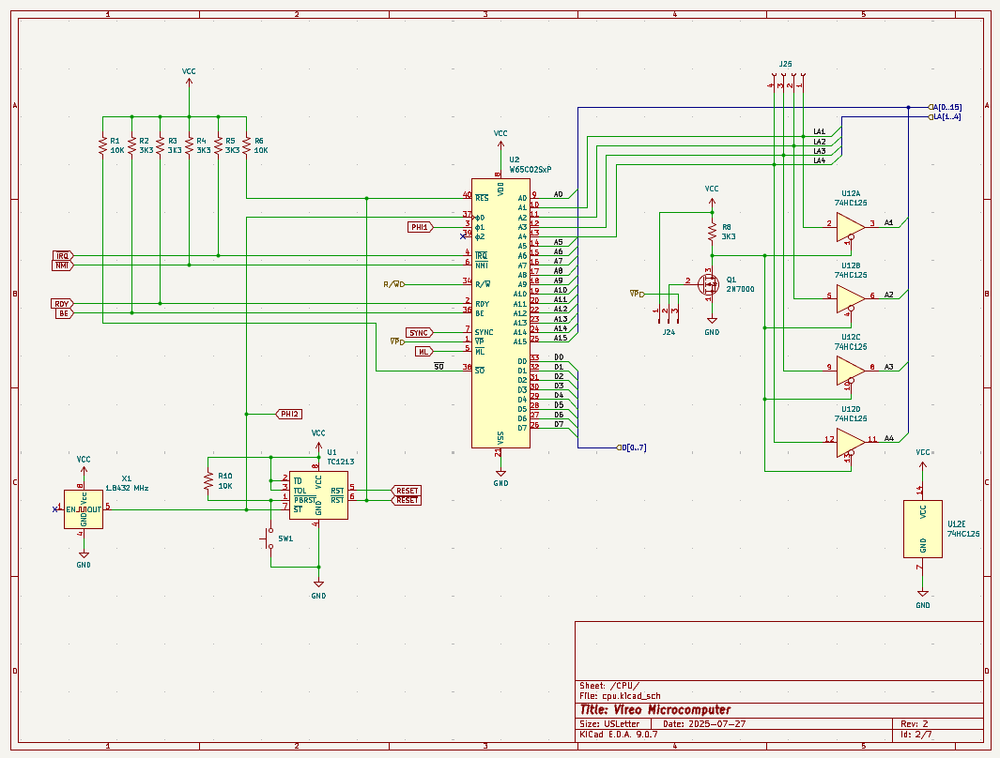
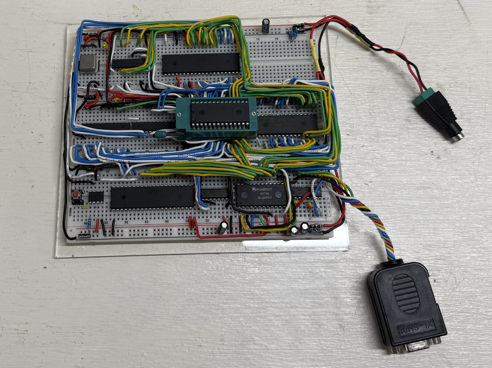
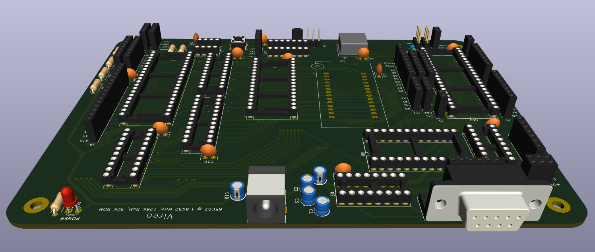
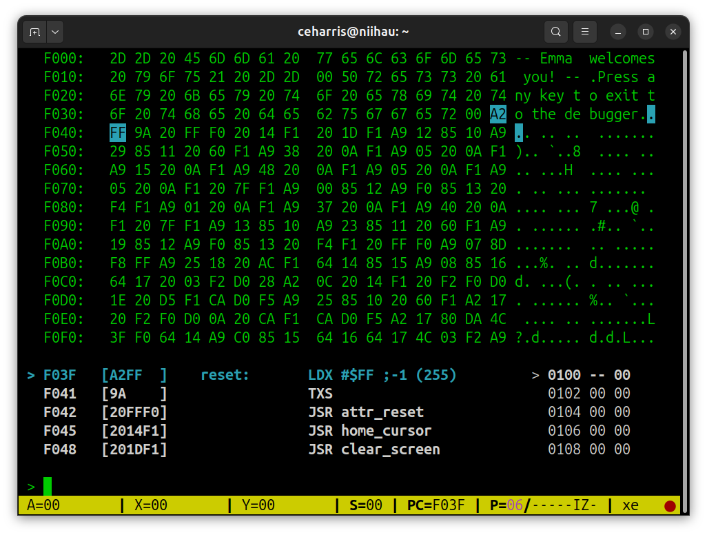

#  WDC65C02 Emulator in Rust
## Designing and planning with an AI assistant

#### Carl Harris
##### Chief Technology Architect
##### Virginia Tech Division of IT

---

### Where To?

- Talk about effective ways to use a coding agent to design and plan a software product
  - Detailed architecture and design specifications
  - Manageable implementation plans
  - Applicable to design and planning in other spheres
- Emphasis
  - Changing your perspective about the AI assistant's capabilities
  - Mimicking the way you'd work with a human team member

---

### Disclaimer 1

- I'm going to describe a personal project in a domain that might not be familiar
  - This is a deliberate choice to keep you focused not on the specifics of this project, but on how to get good specifications and plans from AI
- We're not going to look at any significant code -- another deliberate choice

---

### Disclaimer 2

- No use of university resources for this project
  - All the AI work was done using Claude models (mostly Opus) accessed via my personal AWS account
  - On my own time
  - At a cost of about $25

---

### The Setting

- I'm a retro-computing enthusiast
- The MOS 6502 was the basis for many early microcomputers
  - Commodore VIC-20 and C64, Apple I/II/III, Acorn, etc...
  - One of my favorites for its simple instruction set architecture
- I design and build computers using real legacy hardware (much of which can still be found on the market)
  - Design idea → Schematic design → Breadboard prototype → PCB design → Finished product

---



---



---



---

### The Problem

- Developing and debugging code for your own hardware is a slow and often frustrating process
  - Starting from scratch
  - Creating everything from the bare metal on up


---

### Solution!

Use an emulator and debugger on modern hardware instead.

So I wrote one called Emma65 using plain old C
- NCurses-based; the UI runs in a terminal
- Virtual I/O support
  - VT220-compatible console; plumbed using old-school pipes
  - Serial port; emulated UART connecting a terminal program via a PTY or a socket
  - Emulated 6522 VIA for GPIO, timers, etc; can even interface to real hardware!

---



---

### New and Improved?

- Wanted a largish project to exercise my Rust-fu
- Tauri is a really nice cross-platform UI framework
  - Rust backend, HTML/CSS/JavaScript frontend
- Could integrate my existing C-based emulator, disassembler, etc.
  - But wouldn't it be more interesting to recreate those in Rust, too?

---

### The First Prompt

```text
I want you to help me create a design for an emulator for the WDC65C02 microprocessor using the Rust language. 
The emulator should be realized as a Rust module whose public API is to be used by other components of a
development and debugging platform. The emulator does not need to be cycle accurate. It should support a 
configuration of emulated ROM, RAM, and IO devices. It should allow both single-step execution (fetch and 
execute a single instruction at the current program counter) and asynchronous free-running execution (start 
executing at the current program counter). The call to start free running execution should return a future 
that can be used to stop execution. It should allow configuration of a closure that will evaluate watch 
expressions before executing the next instruction. Ask me additional questions to complete your understanding 
of what's required.
```

- Key point: Think of the AI assistant as a senior developer to whom you can give high-level direction
- Use language that suggests an interactive dialogue, not simply a request to be filled
- Emphasis on gaining clarity about the outcomes and requirements

---

### Clarifying Questions Resulting from the Prompt

```
 1. Should the address map (which ranges are ROM, RAM, or IO) be configurable at construction time, or do you want a 
    fixed layout (e.g., zero page RAM, ROM at $FF00-$FFFF for vectors, etc.)?
 2. For IO devices, are you thinking a trait that users implement, with memory-mapped registration at specific address 
    ranges? Or something more abstract?
 3. Should memory reads/writes be observable from outside (e.g., a bus trace callback for the debugger)?
 4. How should IRQ, NMI, and RESET be triggered — method calls on the emulator from external code? 
    Should they be safe to call from another thread during free-running execution?
 5. When the watch closure fires before each instruction, what should it return? A simple "continue or stop" decision? 
    Or richer control like "stop and report reason"?
 6. Should there also be explicit breakpoint support (break on PC address), or is the watch closure the sole mechanism
    for that?
 7. What CPU state needs to be inspectable — just registers/flags/PC/SP, or also things like cycle count, last 
    instruction disassembly, etc?
 ... (continues)
```

- These are all points on which my intent wasn't clear
- Directing the assistant to ask questions helps to ensure that it isn't guessing about my intent

---

### Teeing up an Interactive Q & A Session

```
User:      I'd like to address your questions in order, one at a time.
Assistant: Okay, I'm ready to start with the first one whenever you're ready.
...
```

- Key point: I'm reiterating that this is dialogue, and I'm setting the stage for interaction on each of the followup questions.

---

### Additional Follow-Ups Really Narrow in on Intent
```text
Q2:  For IO devices, are you thinking a trait that users implement, with memory-mapped registration at specific address 
     ranges? Or something more abstract?

A2:  IO devices should be implementations of a trait. When configuring the memory subsystem, the user will map the 
     desired devices into the address space. Emulations of some common IO devices (e.g. the 6522 VIA, the 6551 ACIA) 
     will be included in the emulator module. The external interface to these IO devices will be sockets (TCP or UNIX 
     domain) or in some cases (e.g. a serial terminal) a master-slave PTY pair.

Follow-up Q:  Should the socket/PTY plumbing live inside the device emulation (e.g., the ACIA implementation owns its 
              PTY), or should it be a separate layer that the device delegates to?
Follow-up A:  The socket/PTY plumbing should be in a separate layer. This will not only facilitate testing of the IO
              device emulation, but it will also allow a given IO device to be configured with the user's preferred 
              backend plumbing.
```

- The assistant has correctly inferred the need for another layer to keep things loosely coupled. 
- The question itself gives me confidence the AI assistant is on the right track in the design

---

### You Don't Have All the Answers, and That's OK!

```text
Q10: Do you need the full WDC65C02 instruction set (including the bit manipulation instructions like BBR/BBS/RMB/SMB), 
     or just the base CMOS 65C02 additions over the NMOS 6502?
A10: I do want support for the full WDC65C02 instruction set, but perhaps this should be a configurable option 
     (selecting either CMOS 65C02 or WDC65C02). What are the implications of making the instruction set selectable? 
     Do the advantages outweigh the disadvantages?

Assistant responds:

The WDC65C02 adds 34 opcodes over base CMOS 65C02: STP, WAI, BBR0-7, BBS0-7, RMB0-7, SMB0-7.

Advantages of making it selectable:
- Users targeting non-WDC 65C02 systems (Rockwell, Synertek) get validation that their code is portable
- Cheap to implement — a single config flag checked during decode of only 34 opcodes, or two lookup tables
- The kind of thing a development platform should offer

Disadvantages:
- Slightly more configuration surface
- Minor historical muddiness (bit manipulation instructions originated with Rockwell)

User: Let's make it an option

Decision: Include selectable instruction set via `CpuVariant` enum (`Cmos65C02` / `Wdc65C02`).
```
---

### Don't Yield Prematurely

At this point the assistant wants to start creating the design, but I'm not convinced.
```text
Assistant: All of my questions and follow-ups have been answered. Shall I begin creating the design plan?
User:      There are some topics that our discussion hasn't covered, and I'd like to ask some more
           questions first.
Assistant: Where would you like to start?
User:      Let's start with error handling. For example, watch expression evaulation can result in a error (e.g. divide
           by zero). Such errors will need to be reported via the UI. How do you propose to support this requirement?
```

- The assistant can do a lot for you, but your **human judgment** and **domain expertise** are still _critically_ important.
- The follow-up dialogue from this first question led to several questions from the assistant on what constitutes error and how to handle those errors.

---

### When it's Time to Make a Plan, Emphasize that it's a Draft

```
User:      I believe that we're ready to plan the design. First write a detailed transcript of our
           ideation dialogue to the file named `emulator-ideation-phase.md`, then you may begin creating the first 
           draft of the design.
Assistant: Got it. I'll write the transcript, and create a draft plan for your review. My plan will focus 
           on the main elements of the design we discussed, and will include code only to define the important 
           interfaces between components and small examples when necessary for clarity.
```

- Pro tip: Save transcripts of your interaction with an assistant
- The assistant has inferred that I'm not looking for it to write code at this point, but if it hadn't made that clear, I would have given it that instruction myself.

---

### Review the Plan with a Critical Eye

- You're still thinking of the assistant as a very capable and experienced senior developer, but certainly not infallible
- Review the design thoroughly and prepare questions and/or topics for further refinement
  - As with any design plan, gap analysis is the most difficult
- You would do this if the design was created by a team member
  - Do no less when the team member is an AI assistant

---

### Refining the Plan

- More often than not, when I read the plan, I realize that there are things that _I, the human_, left out.
- The plan truly is a draft
  - My language has been clear all along that the goal of the interaction was to create and refine a draft into a final design plan
- Now I can resume the session and engage in further dialogue to finish fleshing out the missing elements of the design
  - Tone and pace are critical to the effectiveness of this interaction


---

<!-- _class: lead -->
### _Review the Refinement Interaction Transcript_

---

<!-- _class: lead -->
### _Review the Design Specification/Plan_

---

### The Right Time for a Context Reset

```text
User:   In `emulator-specification.md` is a plan for a Rust-based emulator for the 65C02 processor. I'd like to 
        collaborate with you to develop a project plan for implementation. But first, I'd like to share a bit more 
        context about how the output of this project fits into the larger product.

Assistant:
        [Read emulator-plan.md — a thorough architecture document covering the WDC65C02 emulator as a Rust library 
        crate with CPU, bus, device, transport, interrupt, watch, execution, and disassembler modules.]

        This is a thorough architecture document. I'd love to hear the broader context — how does this emulator library
        fit into the larger product? Understanding the consumer(s) of this API will help shape the implementation plan.
```
- Key point: I started a new session here
  - It's like I'm working with a different assistant now
  - Discard previous context to keep this interaction grounded in implementation planning rather than design-related tangents.
  - Also reduces costs; smaller prompt context

---

### Going from Design Plan to Implementation Plan

My first prompt told the assistant that I wanted to create a Rust module, without any real discussion of how and where it will be used.
  - Deliberately omitting the larger setting to keep the discussion grounded in module design specifics
  - Now that we're getting closer to creating an implementation plan, that additional context will be helpful
  - Align the implementation plan so that it produces artifacts that "fit" the larger product

---

### Instruct the Assistant to Produce an Actionable Plan

```text
User:          I'm looking for a plan that builds incrementally, in units of work sized appropriately to allow human 
               review via merge requests. I'd prefer the work to be relatively tightly scoped to one subsystem at a time 
               to the extent practical. I'd want to see unit tests developed with each unit of work, with subsequent
               units of work used to introduce more complex integration tests and functional tests.
Assistant:     That's a clear development philosophy — bottom-up, test-as-you-go, with MR-sized units that a reviewer
               can hold in their head. Integration tests emerge naturally as subsystems compose.
```

- Key point: I want the assistant to produce a plan whose units of work are sized appropriately for thorough human review.
- As we've seen all along, making intent clear will produce better results

---

### An Addition to the Specification

It's not too late for me to introduce another aspect to the design specification.

```text
Before we continue on the implementation plan I'd like to discuss how a peripheral device might communicate with the 
6522 VIA, and further refine that aspect of the architecture specification. 

[Provided `emulator-via-protocol.md` — a protocol specification for VIA peripheral communication over sockets, with 
binary and ASCII message formats for GPIO port state changes and control signal state changes.]
```

- This prompt led to another interactive dialogue to clear up the assistant's questions about the protocol, affecting
  both the specification and the implementation plan
- Pro Tip: Make sure that the assistant updates the revised specification stored in the project

---
<!-- _class: lead -->

### _Review the Implementation Plan_

---

<!-- _class: lead -->

### _Quick tour of GitHub issues and pull requests_

---

### Model Choices Truly Matter

To work at this level of abstraction, you need a high-end frontier model with strong reasoning.
- The interactions and results shown here were produced using Anthropic Opus 4.6
- I would expect OpenAI's GPT 5.4 to perform very well for this level of work
- I'm interested to hear experiences using other models, especially those that aren't right at the frontier

---

### Choose the Right Model for the Phase of Work

With a detailed design specification and implementation plan in hand, we just need a model with good coding skills.
- I'm using Anthropic Sonnet 4.6 for implementation, and the per-MR outputs have been impressive
- Could also use a good open weights model
  - My choice might be Gemma 4
    - 31B (Dense)
    - 26B (Mixture-of-Experts)
  - Kimi K2.6 would likely perform well too

---

### Closing Tip #1

Don't prompt by thinking about small tasks one at a time
- A good model isn't a student intern
  - It truly can perform like a senior team member
- Models perform best when they have enough context to infer your intent
  - Small task-centric prompts tend to obscure intent

--- 

### Closing Tip #2

Don't let the assistant guess when your intent isn't clear
- Be explicit in asking for clarifying questions and dialogue to reinforce intent
- Require the assistant to create a plan and defend it, before starting on any implementation
- Look carefully for gaps in the plan and amend before accepting it

---

### Closing Tip #3

For ground up development projects, split design specification from implementation planning
- Keeps the interactions grounded in ways that are most advantageous
- Lower costs through context reduction

---

### Closing Tip #4

Tell the assistant to make transcripts of planning dialogues
- Provides documentation for substantiating design decisions later
- Review can really hone your skills at interacting with an assistant

---

### Closing Tip #5

Tell the assistant to save each plan it creates as a document within your project
- Allows you to cold start a fresh session with all the relevant details and decisions
- Facilitates switching between models and contexts
- Provides an additional foundation of documentation for future work on the product/project

---

### Parting Thought

Frontier models in mid-2026 are **more than capable** of collaborating with you at very high level. The challenge for you is to learn to transition from doing the work to _specifying the work to be done_ in ways that draw out your intent and lead to the outcomes you would have produced yourself.
  
---

<!-- _class: lead -->

### _END_

